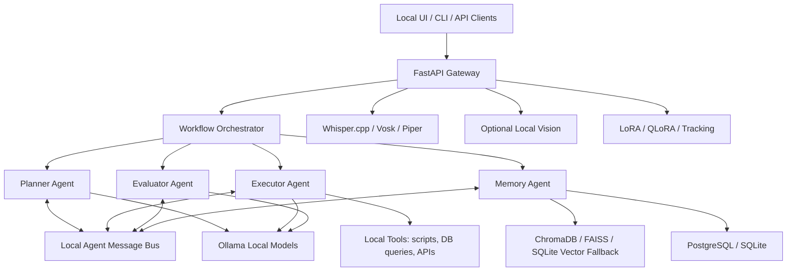

# AgentForge AI Architecture

## 1. System Architecture

AgentForge AI is a local-first AI operating system made of independently replaceable modules. The default runtime is Docker Compose on localhost, with all inference handled by local model servers.



### Runtime Modes

Offline mode is the default. All features use local services, local files, and local model weights. Network calls are blocked unless explicitly enabled.

Online mode is optional. It can fetch external data, sync repositories, or call user-approved APIs. Online mode must never be required for core task execution.

## 2. Folder Structure

```text
agentforge-ai/
  app/
    api/                 FastAPI routers and schemas
    agents/              Planner, Executor, Evaluator, Memory agents
    core/                config, security, orchestration, message bus
    db/                  PostgreSQL and SQLite persistence
    models/              Ollama, vLLM, ONNX, TorchScript adapters
    rag/                 ingestion, chunking, embeddings, retrieval
    speech/              Whisper.cpp, Vosk, Piper adapters
    tools/               Local tool registry and sandboxed actions
    vision/              Optional CV pipelines
    research/            Fine-tuning and experiment tracking
  docs/                  Architecture and implementation docs
  docker/                Dockerfiles and offline bootstrap scripts
  models/                Local model manifests and mounted weights
  data/                  Local documents, vector stores, caches
  scripts/               Installers and setup helpers
  tests/                 Unit and integration tests
```

## 3. Tech Stack

Core:

- Python 3.11+
- FastAPI for localhost APIs
- Pydantic Settings for configuration
- Ollama for local LLM serving
- PostgreSQL as the primary memory database
- SQLite fallback for edge and single-file deployments
- ChromaDB by default, FAISS optional for embedded deployments
- Redis for cache and lightweight message coordination
- FastAPI TestClient plus pytest for local verification

Inference:

- Ollama for Llama 3, Mistral, Gemma, Phi, and DeepSeek families
- GGUF quantized model weights
- Optional vLLM for GPU-heavy serving
- ONNX Runtime and TorchScript for specialized local models

Speech:

- Whisper.cpp and Vosk for speech-to-text
- Piper TTS for text-to-speech

Edge:

- Raspberry Pi: small quantized models, SQLite, FAISS, no GPU assumption
- NVIDIA Jetson: CUDA-enabled inference path
- Apple Silicon: Metal acceleration through local model backend support

Security:

- No telemetry by default
- Local-only APIs
- Optional encrypted storage
- Air-gapped installer path
- Feature-gated online mode

## 4. Step-by-Step Implementation Plan

1. Bootstrap the local runtime.
   - Add Docker Compose services for API, Ollama, PostgreSQL, ChromaDB, and Redis.
   - Add health checks and localhost-only ports.
   - Add offline model directory mounts.

2. Implement inference abstraction.
   - Create an Ollama client with chat, embeddings, streaming, and model listing.
   - Add model profile support for Llama 3, Mistral, Gemma, Phi, and DeepSeek.
   - Add adapter interfaces for vLLM, ONNX Runtime, and TorchScript.

3. Build the agent runtime.
   - Define a common Agent interface.
   - Implement Planner, Executor, Evaluator, and Memory agents.
   - Add a local orchestrator that passes structured messages between agents.
   - Persist every task, plan, result, and evaluation.

4. Add tool usage.
   - Create a local tool registry.
   - Support safe scripts, database queries, filesystem reads, and approved APIs.
   - Add tool audit logging.

5. Add persistent memory.
   - Use PostgreSQL for task state, conversations, and structured memory.
   - Use ChromaDB or FAISS for vector search.
   - Use SQLite fallback when PostgreSQL is unavailable.
   - Add cache layer for repeated prompts, embeddings, and retrieval results.

6. Build offline RAG.
   - Add document ingestion for PDFs, notes, docs, and code files.
   - Chunk documents with metadata.
   - Embed using local embedding models through Ollama or sentence-transformer adapters.
   - Retrieve relevant chunks for context-aware Q&A.

7. Add speech modules.
   - Wrap Whisper.cpp and Vosk as local STT providers.
   - Wrap Piper as local TTS provider.
   - Add multi-language model registry.

8. Add deployment polish.
   - Add one-click installer scripts.
   - Add GPU detection.
   - Add model preloading manifest.
   - Add low-memory edge profiles.

9. Add research features.
   - Add LoRA / QLoRA training scripts.
   - Add local dataset registry.
   - Add experiment tracking stored locally.

10. Harden security.
   - Add offline mode enforcement.
   - Add encrypted secrets and memory storage.
   - Add audit logs.
   - Add air-gapped bundle generation.

## 5. Key Modules and APIs

### Local API

- `GET /health` returns service health.
- `GET /models` lists local Ollama models.
- `POST /tasks/run` executes an autonomous multi-agent task.
- `POST /chat` performs local chat through Ollama.
- `POST /rag/ingest` ingests local documents.
- `POST /rag/query` runs context-aware offline Q&A.
- `POST /speech/stt` transcribes audio locally.
- `POST /speech/tts` renders speech locally.
- `GET /research/experiments` lists local experiment runs.
- `POST /research/experiments` stores metrics for research and ablation work.

### Agent Contracts

Planner Agent:

- Input: user goal, available tools, memory summary.
- Output: ordered subtasks with success criteria.

Executor Agent:

- Input: subtask, tool registry, context.
- Output: action result and trace.

Evaluator Agent:

- Input: goal, plan, outputs.
- Output: validation status, issues, improvement request.

Memory Agent:

- Input: task context, documents, prior interactions.
- Output: retrieved context and persisted memories.

## 6. Docker Setup

The default Docker Compose stack runs:

- `api`: AgentForge FastAPI service.
- `ollama`: local model server.
- `postgres`: primary structured memory.
- `chromadb`: vector memory.
- `redis`: cache and local coordination.

Models are stored in `./models/ollama`. Data is stored in `./data`.

## 7. Sample Core Flow

Example: User asks, "Plan my study schedule."

1. The API receives the goal at `POST /tasks/run`.
2. The Memory Agent retrieves prior study preferences and past plans.
3. The Planner Agent emits structured subtasks with success criteria.
4. The Executor Agent completes each subtask using local reasoning and tools.
5. The Evaluator Agent returns `PASS` or `NEEDS_REVISION` with findings.
6. The Memory Agent stores the task, plan, execution, and evaluation in SQLite/PostgreSQL.
7. The API returns a final answer plus a full agent trace for debugging and research.

## 8. Model Strategy

Default model recommendations:

- General planning: `llama3:8b-instruct-q4_K_M`
- Fast execution: `phi3:mini`
- Coding and reasoning: `deepseek-coder`
- Balanced chat: `mistral`
- Low-memory edge: `gemma:2b` or `phi3:mini`

Model names should map to locally installed Ollama tags. The system must not assume a remote pull is available during offline runtime.

## 9. Production Hardening Roadmap

- Add authenticated local users and role-scoped tool permissions.
- Encrypt SQLite/PostgreSQL memory using SQLCipher or application-layer envelope encryption.
- Add OpenTelemetry-compatible local-only traces with export disabled by default.
- Implement ChromaDB and FAISS adapters behind the current RAG service interface.
- Add a web dashboard for task traces, memory search, and model health.
- Add GPU profile selection for CUDA, Apple Silicon, Jetson, and CPU-only modes.
- Add offline bundle generation for models, Docker images, documents, and migrations.
